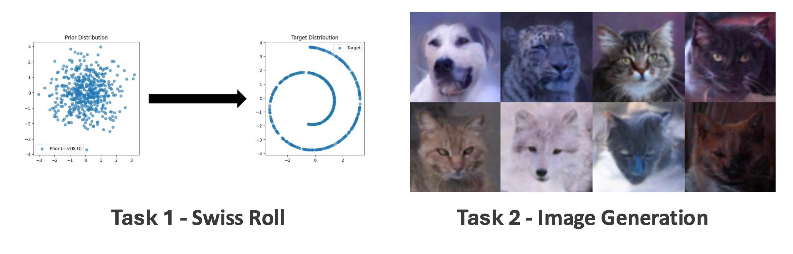

<div align=center>
  <h1>
  Denoising Diffusion Probabilistic Models (DDPM)  
  </h1>
  <p>
    <b>NYCU: Image and Video Generation (2026 Fall)</b><br>
    Programming Assignment 1
  </p>
</div> 

<div align=center>
  <p>
    Instructor: <b>Yu-Lun Liu</b><br>
    TA: <b>Yi-Ruei Liu</b>
  </p>
</div>

---

## 📘 Abstract


In this programming assignment, you will implement the **Denoising Diffusion Probabilistic Model (DDPM)**, a fundamental generative model that powers modern diffusion-based methods such as Stable Diffusion.  
We begin with a simple 2D toy dataset (Swiss Roll) to understand the forward and reverse diffusion processes.  
Then, we extend the pipeline to real images (AFHQ dataset), training a DDPM to generate animal images and evaluate performance using the FID metric.

- [Assignment Instructions (PDF)](./assets/Lab1-DDPM.pdf)
- [Denoising Diffusion Probabilistic Models (DDPM) – arXiv](https://arxiv.org/pdf/2006.11239)

---

## ⚙️ Setup

### Environment
Create a `conda` environment and install dependencies:
```bash
conda create -n ddpm python=3.9 -y
conda activate ddpm
pip install -r requirements.txt
```

NOTE: Please make sure you start training early — Task 2 requires 6+ hours per run.


---

📂 Code Structure
```
.
├── 2d_plot_diffusion_todo        (Task 1: Swiss Roll)
│   ├── dataset.py                # Toy dataset (Swiss Roll, etc.)
│   ├── chamferdist.py            # Chamfer distance for evaluation
│   ├── network.py                # TODO: SimpleNet implementation
│   ├── ddpm.py                   # TODO: Forward & reverse process
│   └── ddpm_tutorial.ipynb       # Training & evaluation notebook
│
└── image_diffusion_todo          (Task 2: Image Generation)
    ├── dataset.py                # AFHQ dataset loader & eval set preparation
    ├── module.py                 # UNet building blocks
    ├── network.py                # UNet
    ├── scheduler.py              # TODO: Noise scheduler (linear, quadratic, cosine)
    ├── model.py                  # TODO: Loss functions & predictors
    ├── train.py                  # Training script
    ├── sampling.py               # Sampling script
    ├── tests                     # Optional self-check for your #TODO code
    │   ├── test_todo.py
    │   ├── _common.py
    │   └── expected_outputs.pt
    └── fid                       # FID evaluation tools
        ├── measure_fid.py
        ├── inception.py
        └── afhq_inception_v3.ckpt

```
---
<h2><b>📝 Task 1 – Swiss Roll</b></h2>

Implement and test DDPM on a 2D dataset.

**Key TODOs:**
- SimpleNet (network.py)
- q_sample, p_sample, p_sample_loop (ddpm.py)
- compute_loss (ddpm.py)

Everything for Task 1 runs from the notebook, which must be started from
inside `2d_plot_diffusion_todo/` — it imports `dataset.py` and `ddpm.py` from
the working directory:

```bash
cd 2d_plot_diffusion_todo
jupyter lab ddpm_tutorial.ipynb
```

<h2><b>📝Task 2 – Image Generation</b></h2>

Extend Task 1 to AFHQ image dataset.

**Key TODOs:**
- `add_noise`, `step`, `beta scheduling` (**scheduler.py**)  
- Loss functions & predictors (**model.py**)  

**Experiments:**
- Train with different beta **schedules**: **linear, quadratic, cosine**   (with noise predictor)
- Compare **predictors**: **noise, x₀, mean**  (with linear schedule)
- Evaluate with FID score

🚀 Usage (Task 2)

All commands below are run from inside `image_diffusion_todo/`.

**Verify your #TODO code (optional, recommended before training)**
```
pytest tests/test_todo.py -q
```

This checks `scheduler.py` and `model.py` against reference values on fixed
inputs. It runs on CPU in about a second, so you can use it to catch mistakes
before committing to a multi-hour training run. 
This only tells you whether your implementation aligns with the TA's, and is
**for reference only** — the test itself is not graded, and a mismatch does not
automatically mean your code is wrong. Your final score depends on the best FID
you report and on the report.

**Training**
```
python train.py --mode {BETA_SCHEDULING} --predictor {PREDICTOR}
```

--mode: linear, quad, cosine
--predictor: noise, x0, mean

Checkpoints and intermediate samples are written to
`results/predictor_{PREDICTOR}/beta_{BETA_SCHEDULING}/{TIMESTAMP}/`, including
`last.ckpt` and the reverse-process trajectory figures `step={STEP}-traj.png`.

If you are short on time, raise `--log_interval`. You still get plenty of
trajectory figures for the report, and the trained model is unaffected.

**Sampling**
```
python sampling.py --ckpt_path {CKPT} --save_dir {SAVE}
```

The beta schedule and the predictor are read from the checkpoint, so you do not
need to repeat them. Passing `--mode` or `--predictor` is still allowed and is
checked against the checkpoint.

Useful options:

- `--num_samples {N}`: how many images to generate (default 500, which is what
  FID is measured on). Use `--num_samples 8` for the per-predictor figures.
- `--save_traj`: also write one reverse-process trajectory, as
  `{SAVE}_traj.png` next to the sample directory (not inside it — the FID
  script measures every image in the directory you point it at).
- `--batch_size {N}`, `--gpu {INDEX}`

**Evaluation**
```
python dataset.py   # Run once to prepare AFHQ eval set
python fid/measure_fid.py data/afhq/eval {SAMPLING_SAVE_DIR}
```

Do NOT forget to run `python dataset.py` first. Otherwise you will get
incorrect FIDs.

📦 Submission

Submit a single zip file {ID}_lab1.zip including:
- Report (report.pdf)
- Code, without the AFHQ dataset (`image_diffusion_todo/data/`), your training
  outputs (`results/`, `samples/`) or the Inception weights
  (`image_diffusion_todo/fid/afhq_inception_v3.ckpt`)

Example:
```
415551001_lab1.zip
 ├── report.pdf
 ├── 2d_plot_diffusion_todo/
 └── image_diffusion_todo/
```
